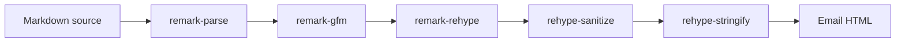

# Markdown Rendering Architecture

## Summary

Markdown rendering is implemented as a `unified` pipeline that parses GFM input with `remark`, converts the Markdown syntax tree to an HTML syntax tree, sanitizes the HTML tree with `rehype`, and serializes the result for Thunderbird compose output.

## Pipeline

The rendering entrypoint should expose a small internal API that hides parser and sanitizer details from Thunderbird compose orchestration. The expected boundary is a function that accepts Markdown source and returns rendered HTML plus a plain-text fallback.

## Package Roles

- `unified`: pipeline engine that orders parser, transformer, sanitizer, and serializer plugins.
- `remark-parse`: CommonMark parser layer used as the base Markdown parser.
- `remark-gfm`: GFM extension layer for tables, strikethrough, autolinks, task lists, and related GFM syntax.
- `remark-rehype`: bridge from Markdown AST to HTML AST.
- `rehype-sanitize`: email-safe HTML policy enforcement point.
- `rehype-stringify`: HTML serializer.

## Sanitization Boundary

The sanitizer is an architectural boundary, not a presentation detail. Thunderbird compose integration must only receive HTML that has passed through the email-safe schema. Raw HTML support, custom attributes, inline styles, images, and URL schemes must be added by changing the sanitizer policy deliberately rather than by bypassing it.

## Bundling

Runtime Markdown dependencies must be bundled into the extension artifact. The extension must not fetch parser, sanitizer, or renderer code from a remote URL at runtime. When the rendering implementation adds npm runtime dependencies, the build should introduce a bundler for the background/rendering entrypoint while keeping the packaged XPI as a static Thunderbird MailExtension directory.

## License Compliance

The selected Markdown rendering packages are expected to be GPL-compatible permissive dependencies. Because the extension is distributed under `AGPL-3.0-or-later`, packaged third-party dependency copyright and license notices must be preserved in the repository and included in the XPI artifact.

## Tradeoffs

The `unified` pipeline has more packages than a single renderer such as `marked`, `markdown-it`, or direct `micromark` usage. The added dependency surface is accepted because md-compose-tb needs explicit AST-stage control over GFM parsing, HTML generation, sanitization, URL policy, and email-safe output.
