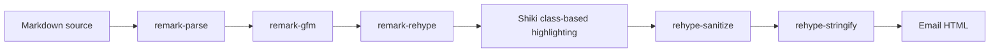

# Markdown Rendering Architecture

## Summary

Markdown rendering is implemented as a `unified` pipeline that parses GFM input with `remark`, converts the Markdown syntax tree to an HTML syntax tree, applies static syntax highlighting with Shiki, sanitizes the HTML tree with `rehype`, and serializes the result for Thunderbird compose output. Multipart plain-text delivery is requested through Thunderbird, but the renderer must not assume that Thunderbird will preserve the Markdown source verbatim as the final `text/plain` MIME part.

## Pipeline

The rendering entrypoint should expose a small internal API that hides parser and sanitizer details from Thunderbird compose orchestration. The expected boundary is a function that accepts Markdown source and returns sanitized rendered HTML.

Thunderbird compose integration should set `ComposeDetails.body` to the rendered HTML and `ComposeDetails.deliveryFormat` to `both` when Thunderbird accepts multipart delivery for the current compose context. A PoC on 2026-05-24 with Thunderbird 140.10.2esr on Linux via Flathub showed that this produces `multipart/alternative` with the rendered HTML part, but the final `text/plain` part did not preserve `ComposeDetails.plainTextBody` as the exact Markdown source. The implementation may still provide `plainTextBody` as a hint if future testing finds value in it, but correctness must not depend on exact Markdown-source fallback.

The architecture intentionally avoids MIME rewriting, hidden compose DOM wrappers, and post-send message mutation. If exact Markdown-source fallback requires one of those mechanisms, it is outside the initial supported implementation.

## Package Roles

- `unified`: pipeline engine that orders parser, transformer, sanitizer, and serializer plugins.
- `remark-parse`: CommonMark parser layer used as the base Markdown parser.
- `remark-gfm`: GFM extension layer for tables, strikethrough, autolinks, task lists, and related GFM syntax.
- `remark-rehype`: bridge from Markdown AST to HTML AST.
- `@shikijs/rehype`: static syntax highlighting layer for fenced code blocks.
- `@shikijs/transformers`: Shiki transformer support for class-based token output when needed.
- `rehype-sanitize`: email-safe HTML policy enforcement point.
- `rehype-stringify`: HTML serializer.

## Syntax Highlighting

Code highlighting uses Shiki with class-based token markup. Shiki is selected because its TextMate grammar and theme model produces higher-quality highlighting than regex-oriented highlighters for common authoring languages such as TypeScript, JavaScript, JSX, HTML, CSS, Markdown, shell, JSON, Python, and diff output. Class-based output is selected over per-token inline styles because it preserves HTML/CSS separation, keeps generated HTML smaller and more maintainable, supports theme changes without rewriting token markup, and degrades to readable plain code if recipient clients discard CSS.

The highlighting layer must be static. The generated email must not depend on JavaScript, remote stylesheets, or client-side highlighting in the recipient's mail client. Unknown or unsupported code fence languages should render as ordinary preformatted code without highlighting rather than attempting unreliable language detection.

Refractor and `rehype-highlight` remain viable alternatives if dependency size or implementation simplicity becomes more important than highlighting fidelity. They are not the primary choice because Prism and highlight.js style tokenizers are generally less expressive than Shiki's TextMate grammar pipeline, and md-compose-tb benefits from editor-quality highlighting while keeping CSS optional.

## Sanitization Boundary

The sanitizer is an architectural boundary, not a presentation detail. Thunderbird compose integration must only receive HTML that has passed through the email-safe schema. Raw HTML support, custom attributes, inline styles, images, token classes, and URL schemes must be added by changing the sanitizer policy deliberately rather than by bypassing it.

The final sanitizer schema must allow only the code-highlight markup required by the selected Shiki output strategy, such as `pre`, `code`, `span`, language classes, and token classes. It must not allow arbitrary author-controlled classes or styles from Markdown input.

## Bundling

Runtime Markdown and highlighting dependencies must be bundled into the extension artifact. The extension must not fetch parser, sanitizer, renderer, grammar, theme, or highlighting code from a remote URL at runtime. When the rendering implementation adds npm runtime dependencies, the build should introduce a bundler for the background/rendering entrypoint while keeping the packaged XPI as a static Thunderbird MailExtension directory.

## License Compliance

The selected Markdown rendering packages are expected to be GPL-compatible permissive dependencies. Because the extension is distributed under `AGPL-3.0-or-later`, packaged third-party dependency copyright and license notices must be preserved in the repository and included in the XPI artifact.

## Tradeoffs

The `unified` pipeline has more packages than a single renderer such as `marked`, `markdown-it`, or direct `micromark` usage. The added dependency surface is accepted because md-compose-tb needs explicit AST-stage control over GFM parsing, HTML generation, syntax highlighting, sanitization, URL policy, and email-safe output.
